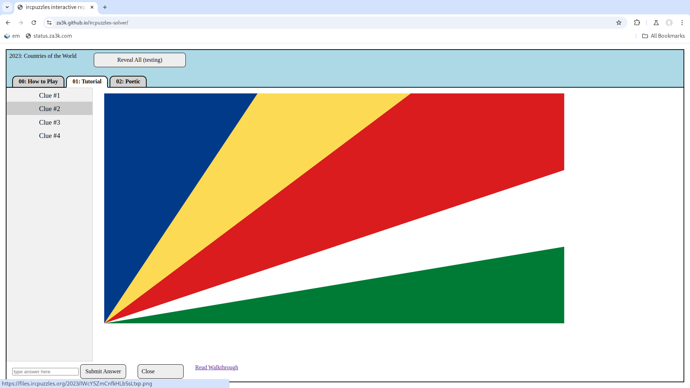

An interactive way to play past years of [#ircpuzzles](https://blog.ircpuzzles.org/). #ircpuzzles is a yearly puzzle hunt on IRC -- check it out!

Demo [here](https://za3k.github.io/ircpuzzles-solver/)

---

TODO:
- [ ] 2024: Write YAML file
- [ ] 2023
    - [ ] yano changes CSP to allow iframes
    - [ ] re-check A4, B5, C3, and C6 after iframes work
- [ ] 2022: Write YAML file
- [ ] 2021: Write YAML file
- [ ] 2020: Write YAML file
- [ ] 2019: Write YAML file
- [ ] 2018: Write YAML file
- [ ] 2017: Write YAML file
- [ ] 2016: Write YAML file
- [ ] 2015: Write YAML file
- [ ] Currently audio files are links, because .wav files play as garbage -- upgrade to in-browser player
